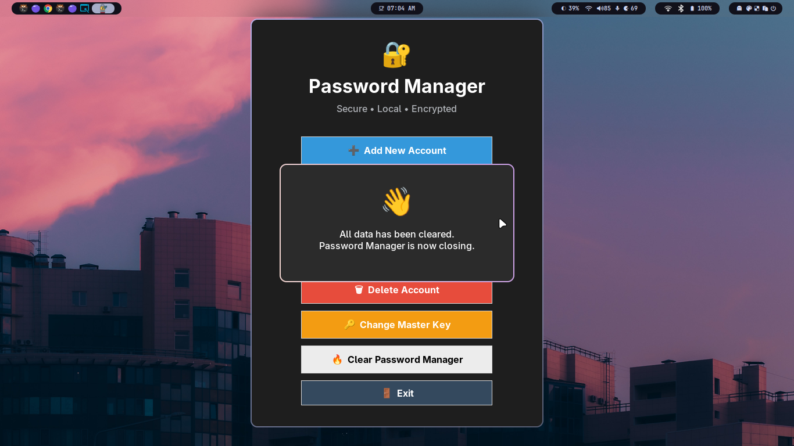

# 🔐 Password Manager (CLI + GUI)

This is a simple and secure password manager made using Python. It supports both a Command Line Interface (CLI) and a Graphical User Interface (GUI).

---

## 🧰 Features

- Add, view, change, delete passwords
- Master key protection
- Encrypted password storage (base64)
- JSON-based storage system
- GUI version (built using Tkinter)
- CLI version (for terminal lovers)
- `.exe` file included for Windows users

---

## 🖥️ How to Run

### CLI Version:
```bash
python password_manager_cli.py
```

### GUI Version:
```bash
python password_manager_gui.py
```

### Windows Executable:
Just double-click password_manager_gui.exe (no Python needed)

---

## 📸 Screenshots

### 🖥️ CLI Version


### 🖼 GUI Version


### 🪟 EXE Running on Windows


---

## 🚀 Author
Made with ❤️ by Ishan

---
